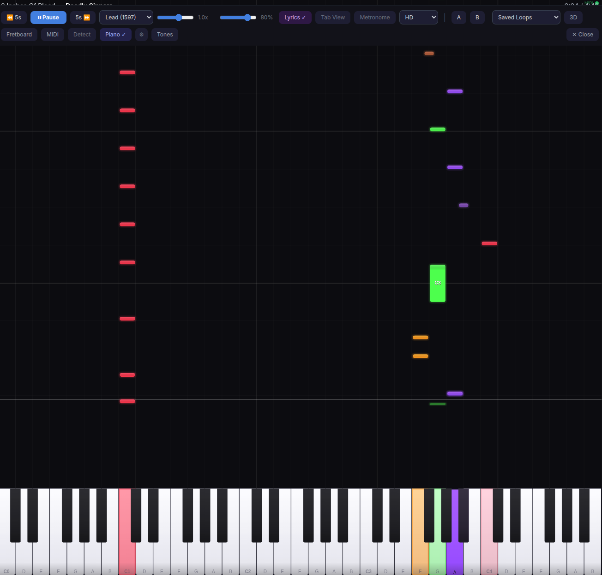

# Slopsmith Plugin: Piano Highway

A plugin for [Slopsmith](https://github.com/byrongamatos/slopsmith) that replaces the guitar highway with a Synthesia-style scrolling piano view, with MIDI keyboard input and a built-in software synthesizer.



## Features

- **Scrolling piano view** — notes fall from top to bottom onto a rendered keyboard, Synthesia/Openthesia-style
- **Neon rainbow colors** — each chromatic pitch gets a unique neon color with multi-layer glow effects
- **Polished keyboard** — 3D gradient shading, rounded corners, press-down animation, and approach color lerping as notes get closer
- **Dynamic zoom** — keyboard auto-scales to show only the octaves with active notes, snapping in clean octave steps
- **Auto-activate** — switches on automatically for Keys/Piano/Synth arrangements
- **MIDI keyboard input** — connect any USB MIDI keyboard via Web MIDI API to play along
- **Hit/miss feedback** — keys glow green for correct notes, blue for freestyle, red for wrong notes
- **Built-in synthesizer** — WebAudioFont-powered playback with 10 GM instruments (Grand Piano, Electric Piano, Organ, Strings, Synth, and more)
- **Accuracy scoring** — optional hit detection with accuracy %, streak counter, and best streak tracking
- **Sustain pedal** — full MIDI CC#64 sustain pedal support
- **Inline settings** — MIDI device, instrument, volume, channel, transpose, and toggles all accessible from the player

## Requirements

- **Chrome or Edge** for MIDI keyboard input (Firefox does not support Web MIDI)
- MIDI features are optional — the piano view works without a MIDI keyboard

## Installation

```bash
cd /path/to/slopsmith/plugins
git clone https://github.com/byrongamatos/slopsmith-plugin-piano.git piano
docker compose restart
```

A "Piano" button will appear in the player controls when you play a song. Click the gear icon next to it to configure MIDI input and sound settings.

## How It Works

The plugin reads note data from the highway renderer and draws them as colored bars falling onto a piano keyboard. Notes use the MIDI encoding convention `midi = string * 24 + fret`, which the [editor plugin](https://github.com/byrongamatos/slopsmith-plugin-editor) uses when importing keyboard tracks from Guitar Pro files.

For any guitar arrangement, the piano view shows the notes mapped to their MIDI pitch positions, which can be a useful alternative visualization even for guitar parts.

### MIDI Keyboard

Connect a USB MIDI keyboard and select it from the settings panel. Play along and get real-time visual feedback:

- **Green keys** — you hit the correct note at the right time
- **Blue keys** — you're playing freely (no matching song note)
- **Red flash** — wrong note
- **Approach glow** — keys light up with the note's color as it approaches the now line

### Instruments

Select from 10 General MIDI sounds via the settings panel:

| Sound | GM Program |
|-------|-----------|
| Grand Piano | 0 |
| Electric Piano | 4 |
| Honky-tonk | 3 |
| Organ | 19 |
| Strings | 48 |
| Synth Lead | 80 |
| Synth Pad | 88 |
| Harpsichord | 6 |
| Vibraphone | 11 |
| Music Box | 10 |

## License

MIT
